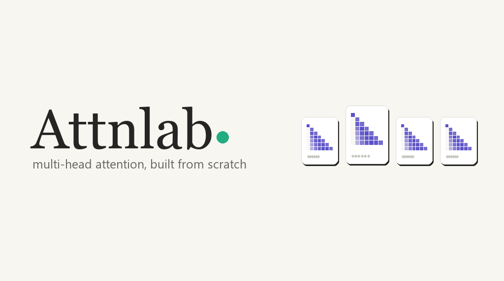
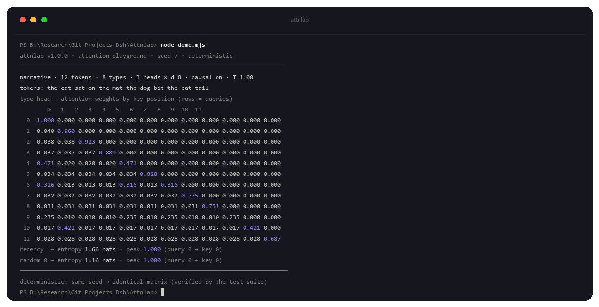
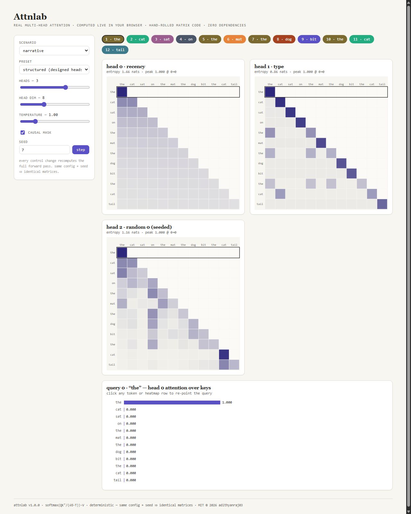
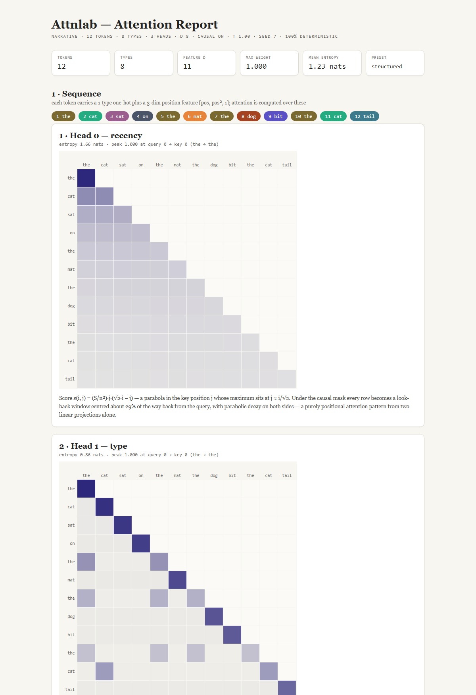
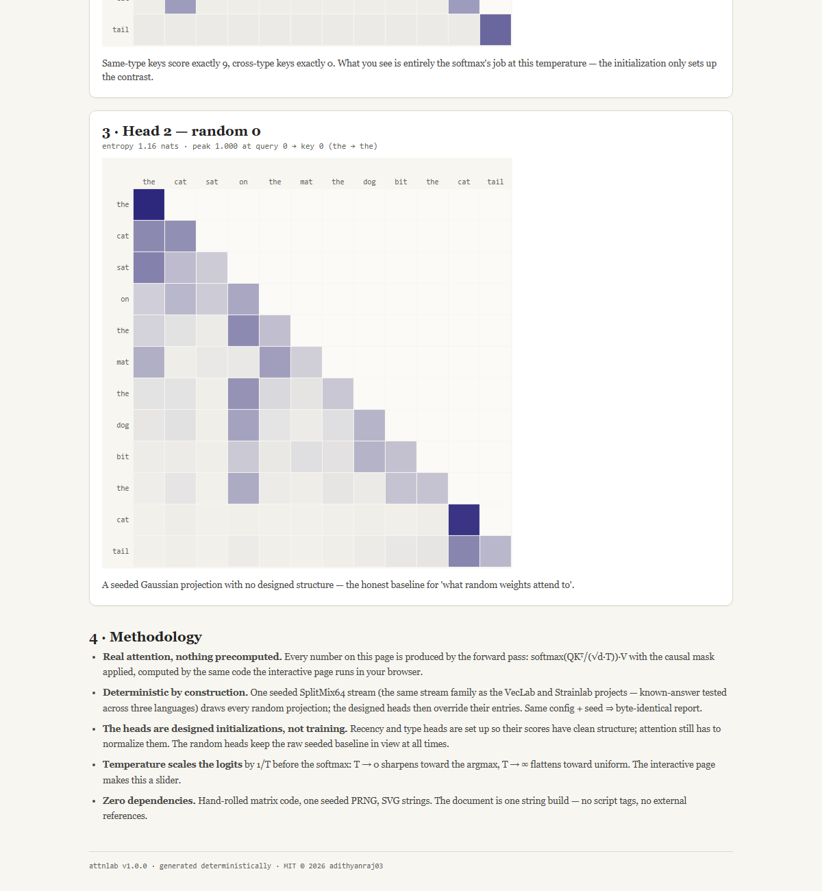

<p align="center">
  
</p>

<h3 align="center">Attnlab — multi-head attention, built from scratch</h3>

<p align="center">
  
  
  
  
  
  
</p>

<p align="center">
  <b>Attention is the one part of a transformer that everyone uses and almost
  nobody recomputes by hand.</b><br>
  Attnlab implements <code>softmax(QKᵀ / (√d·T))·V</code> in ~900 lines of
  dependency-free TypeScript — hand-rolled matrices, one seeded PRNG, and
  *designed* head initializations that make recency and type-matching
  <i>emerge</i> from the math. No PyTorch, no transformers, no training, no
  precomputed weights.
</p>

---

## What this is

A transformer's attention is a very small amount of linear algebra: project
the tokens into queries, keys, and values, take the scaled dot product,
softmax, and mix the values. Everything else — the magic, the "reasoning" —
is a story we tell *about* that arithmetic. Attnlab strips the story away and
shows the arithmetic, one head at a time:

- **`prng`** — SplitMix64 over BigInt (known-answer tested against the VecLab
  Rust and Strainlab Go implementations — the *same stream across three
  languages*) with uniform, integer, and Box–Muller Gaussian draws
- **`mat`** — row-major matrices over `Float64Array`: matmul, transpose,
  scale, a stable temperature-scaled softmax, causal masks, argmax, entropy
- **`attn`** — scaled dot-product attention (single head) and multi-head
  concatenation, returning the full N×N weight matrix for inspection
- **`model`** — three deterministic token scenarios, the [type one-hot |
  position] feature layout, and head plans: a *recency* head and a *type*
  head whose projections are designed so their scores have closed form, plus
  seeded *random* heads as the honest baseline
- **`svg` / `app`** — self-contained SVG heatmaps and the interactive page:
  every control change recomputes the forward pass and redraws
- **`report`** — the standard run rendered as a single self-contained HTML
  document, byte-identical on re-render

## The math

Each token carries a one-hot type vector plus a 3-dim position feature
`[pos, pos², 1]`. Each head holds its own `W_q`, `W_k`, `W_v`; attention is
the textbook formula, computed for real on every render:

```
scores = Q Kᵀ          (N×N)
scores /= √d · T       (scaled, temperature-scaled)
scores[j > i] = −∞     (causal)
weights = softmax      (per row, stable)
out     = weights · V
```

Two of the three default heads are *designed*: their projection entries are
chosen so the raw scores have a closed form, and you watch the softmax turn
that structure into a distribution.

**The type head** sets `W_q[type_r][r] = W_k[type_r][r] = 3`, so a key of the
same type as the query scores exactly `3·3 = 9` and every other type scores
exactly `0`. After scaling and softmax that is a hard preference for
same-type keys. Watch the "the" rows of the matrix below: weight spreads
evenly across the *earlier* "the" tokens and nothing else.

**The recency head** is built from the position features so that the raw
score is `s(i,j) = (S/n²)·j·(√2·i − j)` — a parabola in the key position whose
maximum sits at `j ≈ i/√2`. Under the causal mask that becomes a *look-back
window* centred about 29% back from the query, with parabolic decay on both
sides. A purely positional attention pattern, from two linear projections
alone.

```
$ node demo.mjs
attnlab v1.0.0 · attention playground · seed 7 · deterministic
narrative · 12 tokens · 8 types · 3 heads × d 8 · causal on · T 1.00
tokens: the cat sat on the mat the dog bit the cat tail

type head — attention weights by key position (rows = queries)
        0   1   2   3   4   5   6   7   8   9  10  11
  0  1.000 0.000 0.000 0.000 0.000 0.000 0.000 0.000 0.000 0.000 0.000 0.000
  1  0.040 0.960 0.000 0.000 0.000 0.000 0.000 0.000 0.000 0.000 0.000 0.000
  2  0.038 0.038 0.923 0.000 0.000 0.000 0.000 0.000 0.000 0.000 0.000 0.000
  3  0.037 0.037 0.037 0.889 0.000 0.000 0.000 0.000 0.000 0.000 0.000 0.000
  4  0.471 0.020 0.020 0.020 0.471 0.000 0.000 0.000 0.000 0.000 0.000 0.000
  5  0.034 0.034 0.034 0.034 0.034 0.828 0.000 0.000 0.000 0.000 0.000 0.000
  6  0.316 0.013 0.013 0.013 0.316 0.013 0.316 0.000 0.000 0.000 0.000 0.000
  7  0.032 0.032 0.032 0.032 0.032 0.032 0.032 0.775 0.000 0.000 0.000 0.000
  8  0.031 0.031 0.031 0.031 0.031 0.031 0.031 0.031 0.751 0.000 0.000 0.000
  9  0.235 0.010 0.010 0.010 0.235 0.010 0.235 0.010 0.010 0.235 0.000 0.000
 10  0.017 0.421 0.017 0.017 0.017 0.017 0.017 0.017 0.017 0.017 0.421 0.000
 11  0.028 0.028 0.028 0.028 0.028 0.028 0.028 0.028 0.028 0.028 0.028 0.687
recency  — entropy 1.66 nats · peak 1.000 (query 0 → key 0)
random 0 — entropy 1.16 nats · peak 1.000 (query 0 → key 0)
deterministic: same seed → identical matrix (verified by the test suite)
```

<p align="center">
  
</p>

<p align="center"><sub>Row 4 ("the") splits its weight evenly across the two earlier "the" tokens (keys 0 and 4). Row 9 ("the") does the same across all four. The rest of the row is the softmax's small leak onto the 9 cross-type keys.</sub></p>

## Quickstart

```bash
npm install        # typescript + @types/node (dev only)

# compile, bundle the self-contained page, done
npm run build

# open the playground — no server needed
start index.html        # Windows   (or: xdg-open / open)

# the terminal demo (the standard seeded run)
node demo.mjs

# render the standard run as a single-file HTML report
node report.mjs --out report.html

# the test suite
npm test
```

There is no `dependencies` key in `package.json`. `typescript` is a
dev-time compiler; the shipped code is plain ES2022 modules with nothing
imported but itself.

## The interactive page

`index.html` is the whole app — controls on the left, live heatmaps on the
right. Every change recomputes the full forward pass in the browser and
redraws the SVG; nothing is fetched and nothing is precomputed.

<p align="center">
  
</p>

<p align="center"><sub>The recency head reads as a clean look-back band; the type head as a diagonal with same-type cross-terms; the random head as the honest seeded baseline.</sub></p>

- **Scenario** — `narrative` (the standard sentence), `alternating`, `blocks`
- **Preset** — `structured` (designed recency + type heads) or `random`
  (pure seeded baseline)
- **Heads / Head dim** — 1–4 heads, each with its own projection
- **Temperature** — 0.25→4.0; the sharpness↔uniform trade-off of the softmax,
  live
- **Causal** — toggle the `j ≤ i` mask and watch the future reappear
- **Seed** — type a seed, or `step` to advance a deterministic LCG (never
  `Math.random`, so a click sequence is reproducible)

Click any token or heatmap row to re-point the query and read that row's
distribution over the keys.

## The report

`report` renders the standard run as a single self-contained HTML document:

- **Summary cards** — tokens, types, feature dim `d`, max weight, mean
  entropy, active preset
- **The sequence** — the 12 tokens colour-coded by type
- **Per-head heatmaps** — the full 12×12 weight matrix per head with an
  entropy/peak stat line and a one-paragraph note on the head's closed form
- **Methodology** — determinism, designed initializations, temperature, zero
  dependencies

<p align="center">
  
</p>

<p align="center">
  
</p>

<p align="center"><sub>Sample report — rendered from the standard run via <code>report.mjs --out report.html</code>.</sub></p>

No external assets, no script tags, prints clean, byte-identical on re-run.

## Tests

73 offline tests, no network, no wall-clock dependence:

- **prng** — SplitMix64 known-answer tests against the exact u64 values the
  VecLab (Rust) and Strainlab (Go) ports produce (the stream is verified
  across three languages), same-seed bit-identity, seed divergence, float
  range/mean, integer range/residue coverage, Gaussian mean/std, span range
- **mat** — hand-computed matmul (including a rectangular product), dimension
  guards, transpose involution, copy-not-alias rows, stable softmax under a
  large offset, temperature monotonicity, causal-mask shape, argmax ties,
  uniform-distribution entropy
- **attn** — a single-head example worked out by hand, row-stochastic weights,
  causal zeroing, temperature-driven entropy, shape guards, multi-head
  concatenation and per-head N×N weight matrices
- **model** — determinism at the weight level, seeds that change the random
  head but not the designed heads, the exact [type | position] feature
  layout, type-head strict same-type dominance and equal same-type weights,
  recency peak at `round(i/√2)` with parabolic decay, causal "no future"
  invariant, config validation, output dimensionality
- **svg** — cell/rect counts, causal mask fill, selected-row stroke, row
  click handlers, bar labels/values, markup escaping
- **report** — house structure, byte-identical re-render, config sensitivity,
  every reported entropy present verbatim, no external references or scripts
- **demo** — deterministic output, standard-state header, a parsed 12×12
  row-stochastic matrix, summary lines, config overrides
- **app** — public surface, default state, the deterministic LCG reseed
  (known-answer), and DOM-free no-op behaviour under Node

```bash
npm test
```

## Design notes

- **Nothing is precomputed.** Every number in the demo, the page, and the
  report is produced by the same forward pass — `softmax(QKᵀ/(√d·T))·V` with
  the causal mask applied — the exact code the browser runs. There are no
  lookup tables, no baked-in weight matrices, no "here's a picture of what
  attention looks like." The picture *is* the computation.
- **Designed initializations, not training.** The recency and type heads are
  set up so their raw scores have a closed form, but the attention map is
  still the softmax's output — the initialization only sets up the contrast,
  the normalization is real. The seeded random heads keep the honest baseline
  in view: this is what a head with no designed structure attends to.
- **Determinism is the brand.** One seeded SplitMix64 stream (the same stream
  family as VecLab and Strainlab — KAT-verified across three languages) draws
  every random projection; the designed heads then override their entries.
  Same config + seed ⇒ byte-identical matrices and byte-identical report. The
  test suite asserts the weight matrices, not just the summary.
- **Temperature is a knob you can feel.** Logits are divided by `√d·T` before
  the softmax: `T → 0` sharpens toward the argmax, `T → ∞` flattens toward
  uniform. The page's slider makes that trade-off visible in real time.
- **Self-contained by construction.** The page is a single HTML file with the
  bundle inlined — no script tags, no fetch, works over `file://`. The report
  is one string build with no external references. Zero runtime dependencies:
  `package.json` has no `dependencies` key at all.

## Roadmap

- A tiny training loop (a few SGD steps on a toy objective) to contrast a
  learned head against the designed ones, side by side
- Keyed-value caches and a sliding-window / banded-mask comparison in the UI
- More scenarios (a dialogue, a code-like token stream) and per-token trace
  of the value mix, not just the weights
- A "why this row" explainer: expand a selected query to show its raw scores
  before scaling and before the mask

---

<p align="center"><b>© 2026 Adithya N Raj</b></p>
